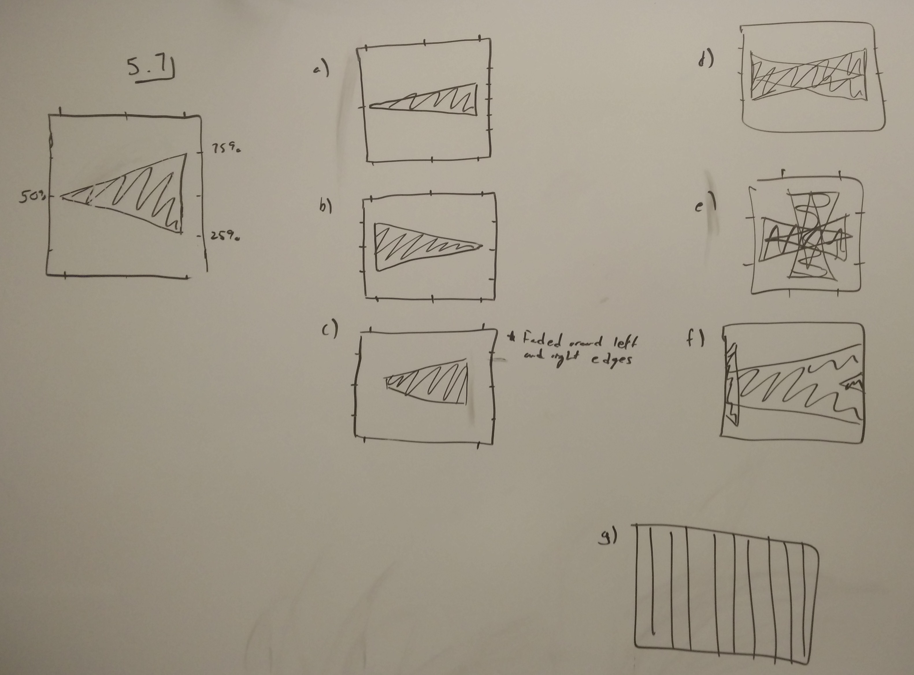

### Answers to textbook problems

#### 4.2 & 4.3

--------------------

#### 4.4

--------------------

#### 5.1

--------------------

#### 5.5
a) Using a double-sided 2DFT sequence on a signal with a slight frequency deviation from the expected frequency, f\_0 + \Delta\_f, the FFT of the impulse (i.e the measured signal by the scanner) would have a linear frequency gradient along k\_x. Thus, when the transform is taken back and the image reconstructed, the delta function would appear shifted in x direction by distance as seen below:

b) If a 1-sided sequence is used, then the projections are taken radially from the origin in k-space. Therefore, the gradient which appears equally in all slices of the double sided sequence now appears inconsistently along each slice. The signal for each slice, s(t), will effectively be multiplied by an exponential term, i.e. s(t)' = s(t)\*exp(-2\*\pi\*x\*\Delta\_f), which will make points with higher x values more affected. Since the projection sequence is symmetric, the recovered image will be effectively just blurred.

------------------

#### 5.6
Since the points are separated by distance L, the frequency of the reconstructed sinusoid is L/2. Half of the period is then 1/L.

a) In order for the reconstruction to be 0, the waveform must be sampled at the nodes of the sinusoid. Therefore, if \Delta\_ky = L/n and subsequently FOV\_y = n/L for any integer n greater than or equal to 1, the points sampled will fall at one of the nodes of the sinusoid.

b) In order for the image to be a single impulse, the same intensity must be observed at every point. Therefore, if \Delta\_ky = 2L/n and subsequently FOV\_y = n/2L for any integer n greater than or equal to 1, the points sampled will always fall at the same point of the sinusoid.

c) In either case, the shifting wouldn't make a difference in terms of the pattern which is observed. However, in the case presented in b), the magnitude of the impulse will vary based on the magnitude of the shift.

----------------

#### 5.7

 a) Since the amplitude was halfed of our phase encoding sequence, the FOV was doubled. Therefore, the triangle was half as tall.
 b) Since the frequency encoding is reversed in direction, the image is read as if flipped across the y axis.
 c) Since the bandpass frequency is too low compared to the sampling frequency, we are over filtering the image and we lose information around the border. This is illustrated in a figure in chapter 5.
 d) Each 90 degree pulse in +x or -x essentially lines up the vectors being recorded in +y or -y, respectively. So, much like when we flipped the sequence in b), we are just repeating the flipping back and forth for each scan and result in a "bowtie" looking thing that essentially is because we observed the object at half the resolution in both directions.
 e) Similar to d), except it is now also projected in -x and +x, so we end up with 4 projections of the image, each with 1/4 of the quality/amount of information as the original.
 f) Since our FOV shrank below the size of our image, we have wrap around alias.
 g) This one seemed a bit odd, but we know that the FFT of horizontal lines is vertical lines, and it asks us to do a FFT instead of iFFT, so that was my best guess.
