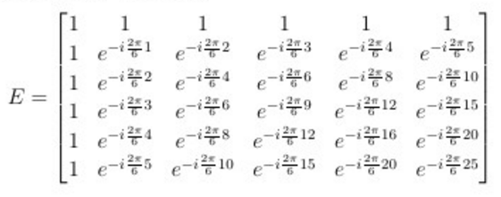

**Question 1:**
> As there is no gradient applied, all pixels have the same phase as one another. Thus, we cannot calculate individual pixel intensities and only get a measurement for the sum of all pixels. The equation becomes:

**Question 2:**
> The encoding matrix takes the shape Nfe x Nx. When we add more frequency encodes, we are adding more rows to the table but they are linearly dependent upon the previous, thus the rank does not increase. If there was relaxation considered in this model, it would only change this if each pixel had different tissue properties.

**Question 3:**
> For answering these questions we'll first define what the rank of these matrices ends up being: rank=min(Npe, Ny)*min(Nfe, Nx)

> a) As we increase Ndt and Npe, we will increase rank until we have reached the number of pixels in the image, at which point the rank is Np. Then, further increase will not affect the rank but will reduce the condition number.

> b) As we decrease Ndt and Npe, we will maintain full rank (Np) until we reach the number of pixels in the X or Y directions for frequency or phase encoding, respectively. Beyond that, we begin to lose rank and then aliasing will occur as multiple pixels will have the same phase accrual.

> c) At Ndt = Npe = 10 (i.e. Np) the rank will be full and the image will be reconstructed. However, the condition number will be very high with only this many samples, meaning that the computation of the inverse is very unstable. Once the number of phase and frequency encodes reaches 19 and upward, the condition number drops considerably, yielding a stable reconstruction.

**Question 4:**
> As can be seen in the equation defined at the start of Question 3, the rank would equal N_pe up until the value of Ny, then the rank would remain Ny. The reconstructed image would have 1 X-pixel.

**Question 5:**
> You need twice as many samples to be able to reconstruct the image and have a low condition number. To achieve full rank but have a high condition number (i.e. an unstable solution), you still only require the sam enumber of samples as previously.

**Question 6:**
> As one would expect, adding noise makes things worse. When we increase our standard deviation, the error in our reconstructed image, understandably goes up.

| Sigma | Error |
|-------|-------|
|0.1000 | 1.0160|
|0.2000 | 3.2022|
|0.3000 | 9.0983|
|0.4000 |11.5341|
|0.5000 |16.4340|

**Question 7:**
> No,  as we established above, the rank of the matrix is as follows: rank= min(Npe, Ny)*min(Ndt, Nx). For recovery, we must have full rank (i.e. rank = Nx*Ny). Therefore, if we increase Npe beyond Ny, or Ndt beyond Nx, it will not improve the recoverability of our image (in the noiseless case), and certainly not enable recoverability if the other is below the number of pixels in it's paired direction.

**Question 8:**
> The dimensions of the encoding matrix are (Npe*Ndt)x(Nx*Ny). As the image gets larger, that means that this matrix will sky-rocket in size. In the 256x256 image case, to have a bare minimum number of samples for full recovery we would have a (256^2)x(256^2) encoding matrix, and in the 512x256 case we would have a (256*512)x(256*512) encoding matrix. This suggests that this model is infeasible for processing even moderately large images.

**Question 9:**
> When we increase both our Npe and Ndt simultaneously, our encoding matrix grows exponentially, but our condition number drops (especially useful if there is noise). The major problem here is that as you increase the number of samples, your computer may rapidly approach a complexity which your computer does not have the power to process.

**Question 10:**
> When working with pixels, we assume that the same phase twist has been applied evenly across the entire pixel. If we worked with continuous values instead of pixels to represent our tissue, it is akin to working with pixels (under the model we currently work) that are infinitely small. Therefore, current processing methods would be completely intractible as Nx and Ny would be infinite, requiring an infinite number of phase and frequency encodes to achieve high enough rank and low enough condition number to recover our image. This, of course, would be WAY too computationally complex to actually solve in practice. As usual, our assumptions (though knowingly incorrect), in this case uniform pixels, are there to help us make intractable problems solveable with some minimal - and knowable - error.

**Question 11:**
> The DFT matrix for a 6 vector experiment can be seen below:

**Question 12:**
> As can be seen in the table below, it consistently takes more time for calculating the psuedoinverse to be computed than the direct computation of the inverse matrix.

|      | Time to calculate | Time to pinv |
|------|-------------------|--------------|
|256   | 0.0023 | 0.0084 |
|512   | 0.0107 | 0.0466 |
|1024  | 0.0507 | 0.2924 |
